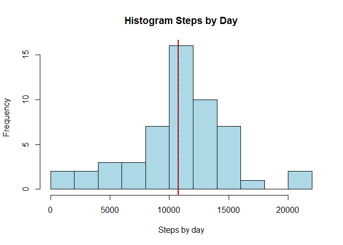
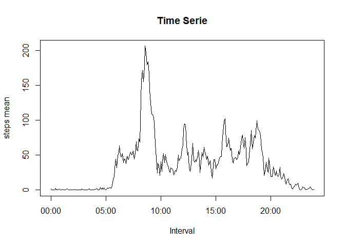
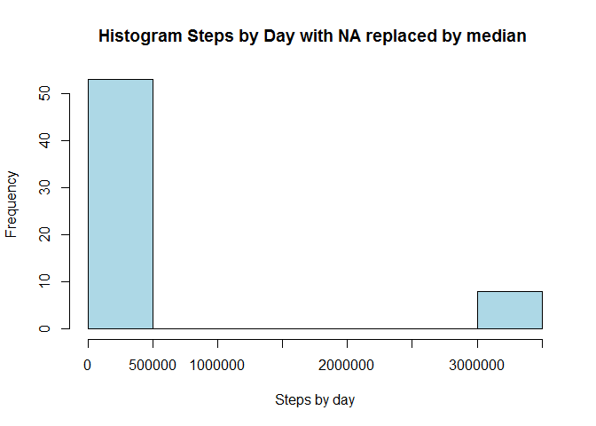
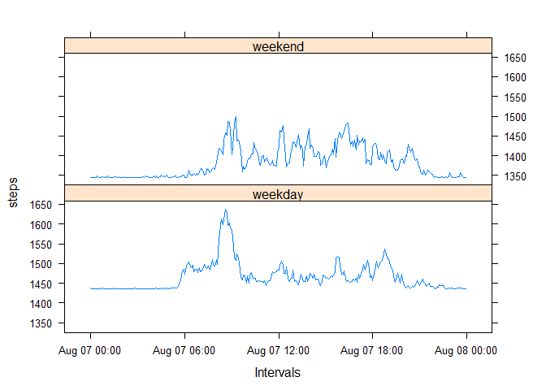

# Reproducible Research: Peer Assessment 1


## Loading and preprocessing the data

```r
data <- read.csv("activity.csv")
data$date<-as.Date(data$date)
```

## What is mean total number of steps taken per day?
Steps:  
1. Calculate set of totals number of steps by day and stored in a variable for reuse it.  
2. Plot an histogram for the set of totals number of steps by day.  
3. Calculate mean and median for the set of totals number of steps by day.  

The histogram below shows a rigth skewed distribution. The mean and median are similar.


```r
#Calculating Sum
stepsbydate <-sapply(split(data$steps,data$date),sum)

#Plotting histogram 
hist(stepsbydate,breaks=10,col="lightblue",xlab="Steps by day",main="Histogram Steps by Day")

#mean
pmean<-mean(stepsbydate,na.rm=TRUE)
pmedian<-median(stepsbydate,na.rm=TRUE)
print(sprintf("media = %f and meadian = %f total number of steps taken per day",pmean,pmedian))
```

```
## [1] "media = 10766.188679 and meadian = 10765.000000 total number of steps taken per day"
```

```r
#plotting lines for mean and median in histogram
abline(v=pmean,col="red", lwd=2)
abline(v=pmedian,col="black",lty=4)
```

 

## What is the average daily activity pattern?
The time seriebelow shows a peak around 800 interval, meaning the number of steps on that interval is higher than the average steps. Between 1000 and 1500 intervals the oscilation of number steps have a constant variation (down and up).


```r
time_mean<-aggregate(steps ~ interval, data = data, mean)
plot(time_mean$interval, time_mean$steps, type="l",xlab="Interval",ylab="steps mean",main="Time Serie")
```

 

```r
int_max<-aggregate(steps ~ interval, data = data, max)
print(sprintf("5-minute interval with the maximum number of steps is %d",int_max[which.max(int_max$steps),1]))
```

```
## [1] "5-minute interval with the maximum number of steps is 615"
```

## Imputing missing values
Missing data were replaced by median because the histogram above shows a rigth skewed distribution. The median is better suited, as cendtral tendency, for this kind of distribution.


```r
#count missing data (NA)
print(sprintf("The total number of missing data (NA) is %d",sum(!complete.cases(data))))
```

```
## [1] "The total number of missing data (NA) is 2304"
```

```r
#Replacing missing data (NA) with median
new_data <- data
new_data[is.na(new_data)] <- pmedian

#Histogram for new_data
stepsbydate <-sapply(split(new_data$steps,new_data$date),sum)
#stepsbydate<-aggregate(steps ~ date, data = new_data, sum)
hist(stepsbydate,col="lightblue",xlab="Steps by day",main="Histogram Steps by Day with NA replaced by median ")
```

 

```r
pmean<-mean(stepsbydate)
pmedian<-median(stepsbydate)
print(sprintf("media = %f and meadian = %f total number of steps taken per day",pmean,pmedian))
```

```
## [1] "media = 415953.573770 and meadian = 11458.000000 total number of steps taken per day"
```

```r
#What is the impact of imputing missing data on the estimates of the total
#daily number of steps?
```
The histogram above shows that replacing missing data by the median makes the variation  of data similar concentrating the range of steps by days on one class.

## Are there differences in activity patterns between weekdays and weekends?

The patterns between weekday and weekend, see plots below, are different. During weekends the behaviour of steps keeps down and up similarly during the all interval and the average of steps are between 1350 and 1450 steps. On the other hand, during weekdays the average of steps stats 1450 and there is peak around 800 interval. Between 1000 and 1500 intervals the oscilation of number of steps on weekdays is lower than on weekends.


```r
#Adding new column to the dataset
new_data$weekday <- apply(new_data,1,function(row) if (weekdays(as.Date(row[2]), abbreviate = TRUE) %in% c("Sat","Sun")) as.factor("weekend") else as.factor("weekday") )

#Groupping weekdad and interval
grouping_mean<-aggregate(steps ~ weekday+interval, data = new_data, mean)

#Plotting panel plots
library(lattice)
print(xyplot(steps ~ interval|weekday, data = grouping_mean, layout = c(1, 2),type="l"))
```

 
